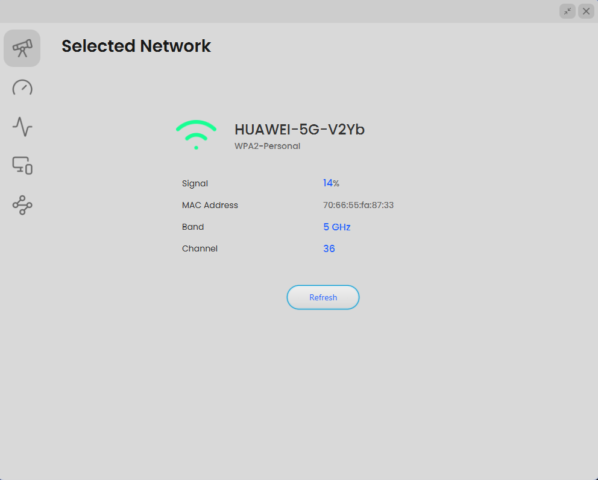
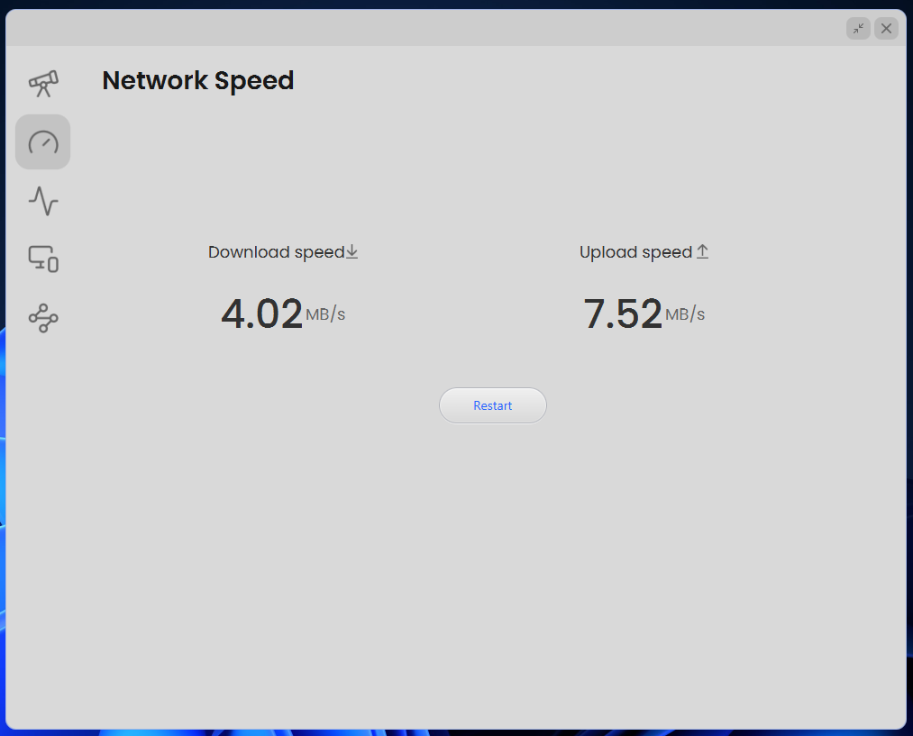
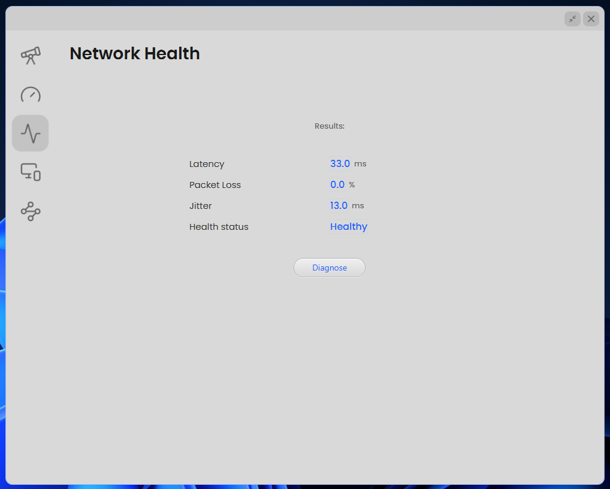
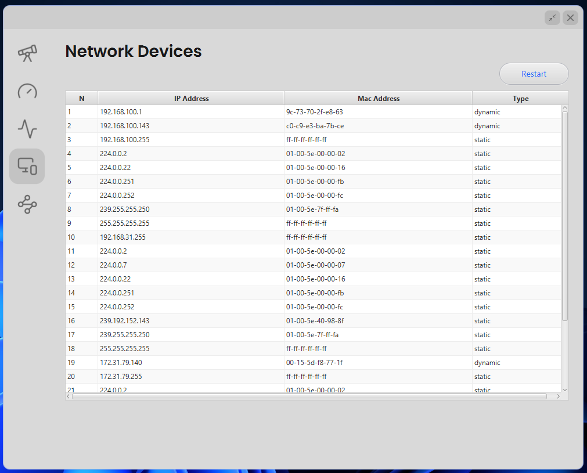
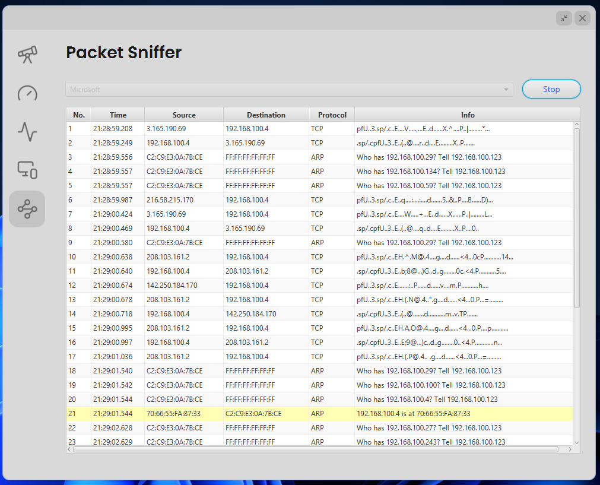
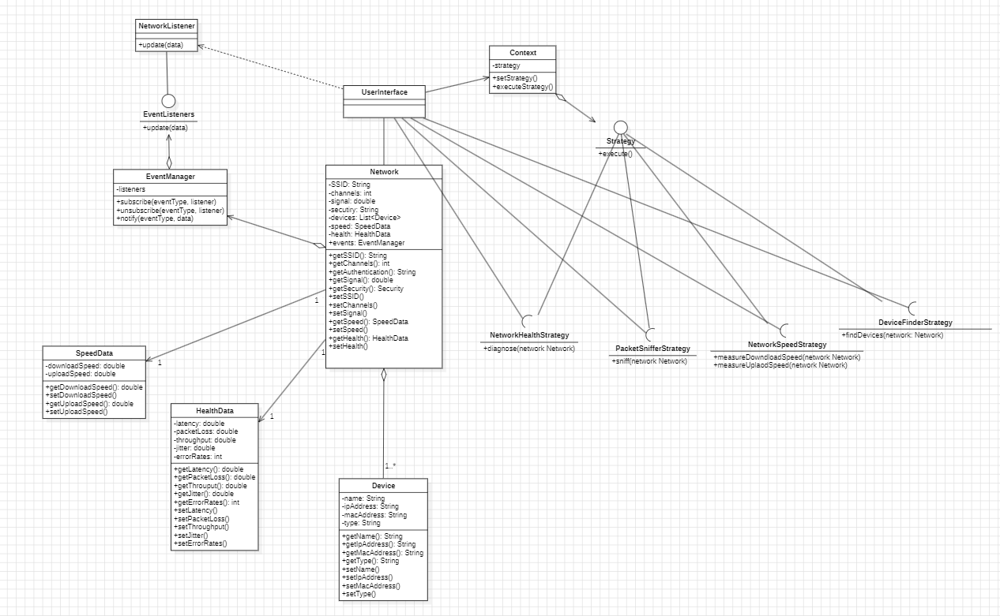

# Network Intrusion Detection Application
## Table of Contents

1. [Introduction](#introduction)
2. [Architecture and Design](#architecture-and-design)
    - [Class Diagram](#class-diagram)
    - [Technical Choices](#technical-choices)
3. [Features](#features)
    - [Network Monitoring](#network-monitoring)
      - [Detailed Network Information Display](#detailed-network-information-display)
      - [Network Speed Measurement](#network-speed-measurement)
      - [Network Health Assessment](#network-health-assessment)
      - [Discovery and Display of Connected Devices](#discovery-and-display-of-connected-devices)
    - [Packet Capture](#packet-capture)
    - [Intrusion Detection](#intrusion-detection)
4. [Implementation](#implementation)
    - [Functional Prototype](#functional-prototype)
    - [Project Presentation](#project-presentation)
5. [Conclusion](#conclusion)

---

## Introduction

In an increasingly connected world, managing and securing computer networks has become a major concern for organizations. This report presents the development of an application dedicated to network supervision and in-depth analysis, combining network monitoring features with intrusion detection capabilities.

This application meets the growing need for powerful tools that not only monitor key network metrics (download speed, upload speed, latency, jitter, throughput, etc.) but also analyze network traffic in real-time through advanced packet capture and analysis capabilities.

The development of this project represents an opportunity to dive deep into modern software engineering. It requires expertise in multiple technical aspects, from low-level programming for interacting with network interfaces to designing sophisticated algorithms for anomaly detection and developing a robust and scalable software architecture. This technical complexity, combined with performance and security challenges, makes this project an excellent case study for exploring best practices in software development.

In this report, we will detail the application’s architecture, its main features, and the technical choices that guided its development. We will focus on the challenges encountered and the innovative solutions implemented to create this application.

---

## Architecture and Design

### Class Diagram

In this project, we created an application to monitor networks using a simple and efficient approach based on well-known design patterns. To organize the code, we developed a class diagram that illustrates how each part of the application interacts.

The foundation of the application is a user interface that controls everything using the **Strategy Pattern**, allowing easy addition or modification of features. There are four main strategies: measuring network speed, assessing network health, analyzing network traffic, and detecting connected devices.

To manage network data, we created a **Network** class that gathers essential information, such as the network name (SSID), channels in use, and signal strength. To ensure the application reacts quickly to network changes, we implemented an **Observer Pattern**, enabling automatic detection of modifications through event listeners.

For measurement purposes, we structured the data using the **Composite Pattern**, with a **SpeedData** class handling download and upload speeds, and a **HealthData** class assessing network health metrics like response time and packet loss.

These design patterns provided a strong foundation for the application: **Strategy** for flexibility, **Observer** for responsiveness, and **Composite** for data organization. This approach allows new features to be added without breaking the system and keeps the codebase maintainable.

### Technical Choices

The choice of **JavaFX** for our network monitoring application is based on several key technical advantages. JavaFX naturally integrates with the **Observer Pattern** thanks to its binding system and observable properties, simplifying real-time updates of network data in the interface. Its graphical library allows for easy visualization of metrics such as speed and latency using responsive components. The use of **FXML** separates the UI from the code, making maintenance easier.

---

## Features

### Network Monitoring

This section covers four key components:
1. **Displaying detailed network information**, including SSID, signal strength, and channels used.
2. **Tracking performance** through precise download and upload speed measurements.
3. **Assessing network health** using metrics such as latency, packet loss, and jitter.
4. **Discovering and displaying connected devices** to provide an overview of active hosts.

#### Detailed Network Information Display

This feature retrieves and displays essential network characteristics, such as SSID, signal strength, MAC address, frequency band, and channel. The data is obtained through system APIs and can be refreshed automatically or manually.

#### Network Speed Measurement

This feature uses the `curl` command to measure download and upload speeds. The program downloads a fixed-size file (20MB or 50MB) from a server and calculates the speed based on the elapsed time. A similar process is used for upload speed measurement. The file sizes are chosen to provide meaningful results while minimizing bandwidth consumption.

#### Network Health Assessment

This feature evaluates network quality and stability by measuring three key metrics:
- **Latency**: Time taken for packets to receive a response.
- **Packet loss rate**: Reliability of data transmission.
- **Jitter**: Variability in response time.

These measurements are performed by sending test packets to remote servers and analyzing the results.

#### Discovery and Display of Connected Devices

This feature detects and lists active hosts on the local network, displaying key information such as IP addresses, MAC addresses, and hostnames. The discovery process scans the network and presents the results clearly in the application’s interface.

### Packet Capture

This feature enables real-time network traffic analysis by capturing packets on a selected network interface. The program decodes each packet, displaying details such as timestamp, source and destination addresses, protocols used, and transmitted data.

The implementation uses **jNetPcap** to capture and analyze packets, classifying them by type (TCP, UDP, ICMP, ARP) and extracting relevant information. The captured packets are displayed dynamically in the graphical interface.

### Intrusion Detection

The application includes a real-time intrusion detection system that analyzes network packets based on security criteria:
- **Monitoring suspicious ports** against a list of known malicious ports.
- **Tracking ICMP activity** to detect flood attacks.
- **Verifying ARP traffic** to identify spoofing attempts.
- **Checking IP addresses** against a database of known malicious IPs.

Each analyzed packet is assigned a security status: **Safe, Suspicious, or Malicious**. This feature helps detect potential threats and alerts the user to suspicious activities.

---

## Implementation

### Functional Prototype

Before starting development, a functional prototype was created using **Figma** to design the graphical components, layouts, and user interactions.

### Project Presentation

When launching the application, the main page displays network details, including signal strength, MAC address, frequency band, and channels.

Subsequent pages include:
- **Speed measurement tools**: A “Start” button initiates speed tests.
- **Network health assessment**: Displays latency, packet loss, jitter, and overall health status.
- **Connected device list**: Shows all active network hosts.
- **Packet capture interface**: Identifies captured packets and classifies them by security status (**Red for malicious, Yellow for suspicious, White for normal**).

---

## Conclusion

This project allowed us to implement modern techniques and technologies. The combination of **JavaFX** for the UI and a **design pattern-based architecture** resulted in a robust and scalable solution. The implemented features cover essential aspects of network monitoring, from basic information display to deep packet analysis and intrusion detection.

This experience not only produced a functional network monitoring tool but also deepened our understanding of network protocols, system programming techniques, and software development best practices. The use of specialized libraries such as **jNetPcap** proved effective in achieving our goals.

The final result is an application that meets network monitoring needs while remaining open to future enhancements, whether by adding new features or improving existing capabilities.

---

## Snapshots

